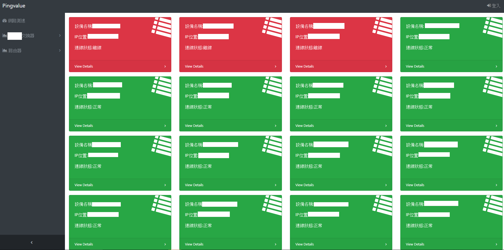
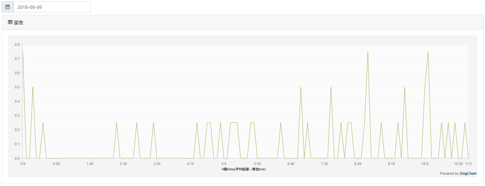
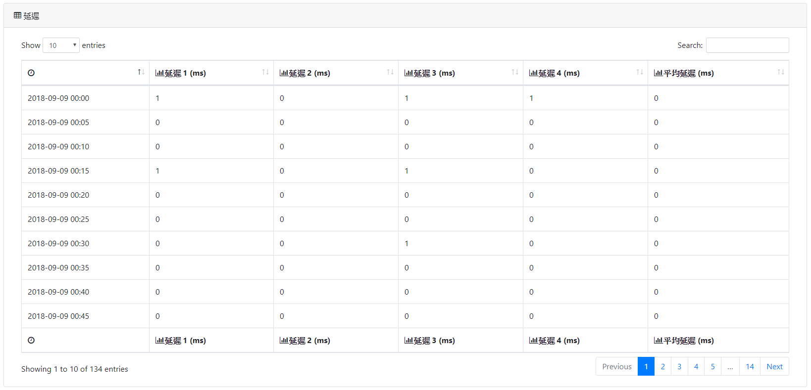
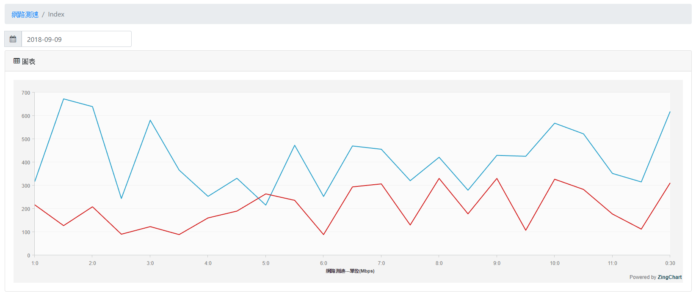
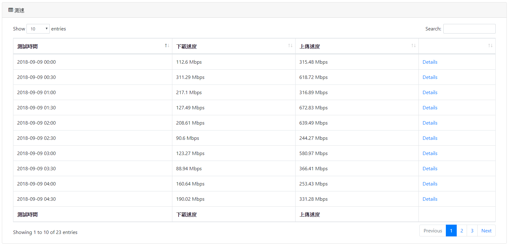
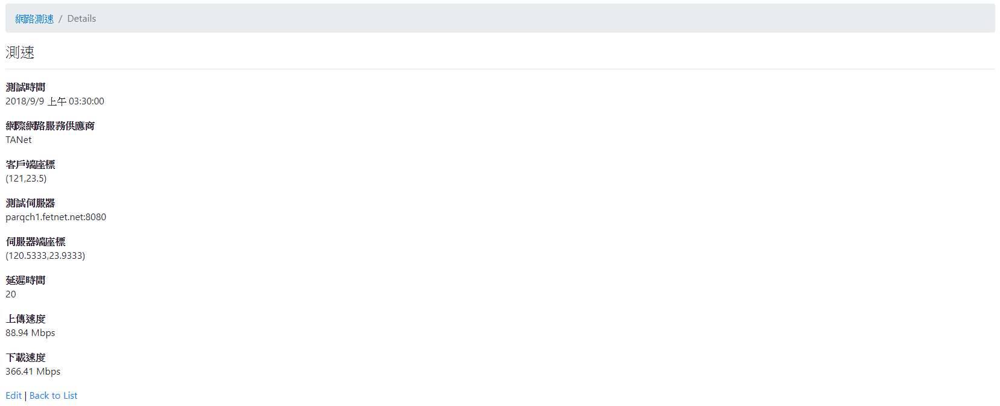
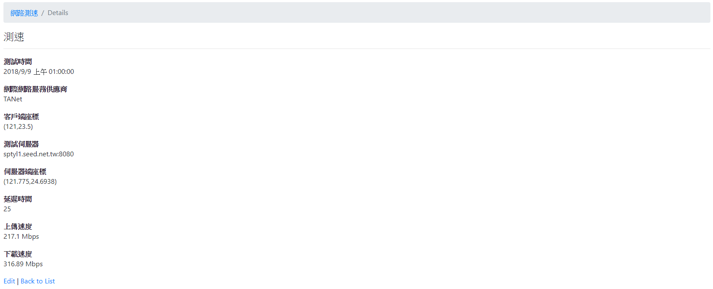

# Pingvalue
Pingvalue系統提供網路管理員視覺化分析組織網路品質，並在內部網路或伺服器發生異常時即時通知網路管理員

首頁-可以檢視所有裝置狀態

視覺化分析網路品質

網路延遲詳細資料-每五分鐘檢查一次

設備異常即時通知

網路測速-每30分鐘連線至[SpeedTest.net](http://www.speedtest.net/)進行網路測速

## 建置環境
- [Windows Server 2012 R2](https://www.microsoft.com/zh-tw/evalcenter/evaluate-windows-server-2012-r2)以上版本
- [IIS](https://zh.wikipedia.org/wiki/%E7%B6%B2%E9%9A%9B%E7%B6%B2%E8%B7%AF%E8%B3%87%E8%A8%8A%E6%9C%8D%E5%8B%99)
- [.net framework 4.7.1](https://support.microsoft.com/zh-tw/help/4033342/the-net-framework-4-7-1-offline-installer-for-windows)
- [Web Deploy](https://docs.microsoft.com/zh-tw/visualstudio/deployment/deploy-iis-with-web-deploy?view=vs-2017)
- [SQL Server](https://www.microsoft.com/zh-tw/sql-server/)

## 部屬方法
待更新...
